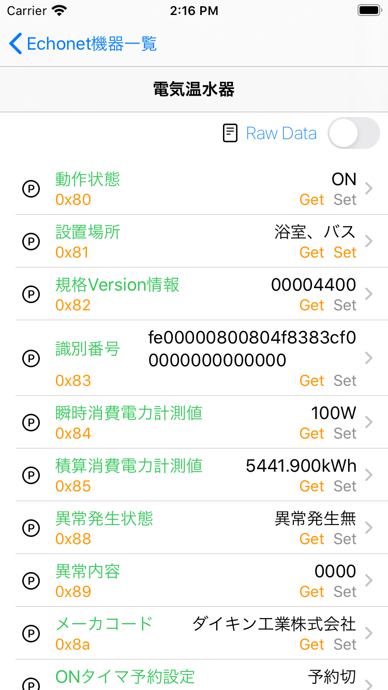
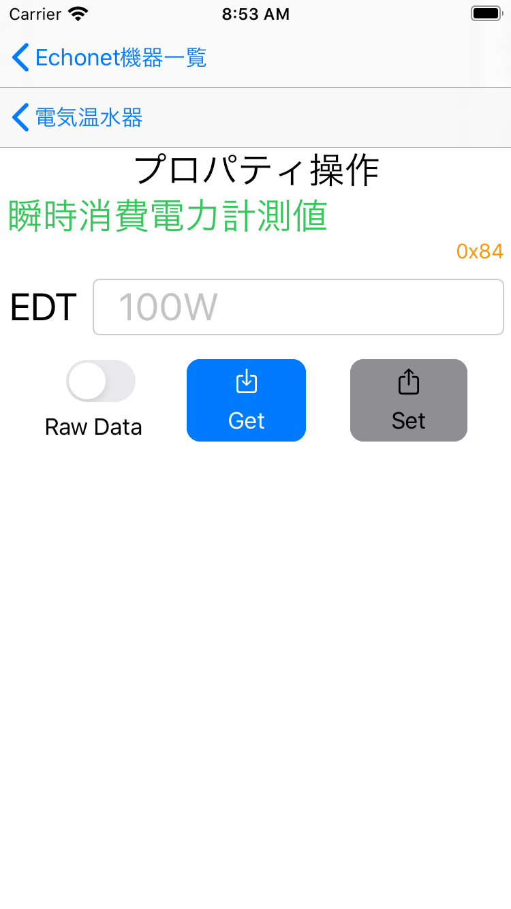

# 概要

-   WiFi 接続された iPhone と同一 LAN 内の EchonetLite 機器を検索し、各機器のプロパティ値を取得するツールです。

# ビルド手順

1. リポジトリを clone
    ```bash
    $ git clone https://github.com/katsumin/EchonetScanner.git
    ```
1. CocoaPods ライブラリをインストール
    ```bash
    $ pod install
    ```
    - 依存ライブラリ（ELSwift）側でエラーになる場合がある
        ```
        Invalid SWIFT_VERSION: Could not parse version component from: '0 4'
        ```
        - 修正内容は下記の２ファイル
            - "Pods/Target Support Files/ELSwift/ELSwift.debug.xcconfig"
            - "Pods/Target Support Files/ELSwift/ELSwift.release.xcconfig"
                ```diff
                - SWIFT_VERSION = 4.0 4.0
                + SWIFT_VERSION = 4.0
                ```
1. Xcode で EchonetScanner.xcworkspace を開く
1. Xcode 上でビルドする

# スクリーンショット

## 機器一覧

<div align="center">

</div>

## プロパティ一覧

<div align="center">

</div>

## プロパティ単位表示

<div align="center">

</div>

## プロパティ一覧（生データ表示）

<div align="center">

</div>

# 依存ライブラリ

-   本ツールは、以下のライブラリを使用しています。
    -   [ELSwift](https://github.com/Hiroshi-Sugimura/ELSwift)
